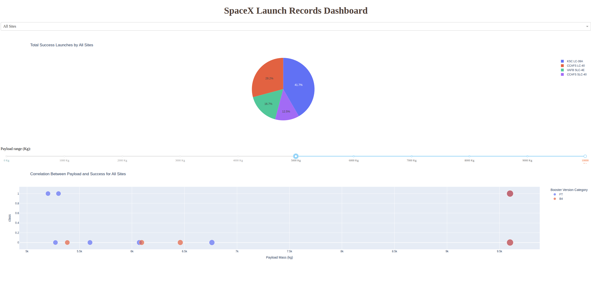

# IBM Applied Data Science Capstone · SpaceX Falcon 9 Landing Success
Predict landing success of the Falcon 9 first stage using public data, EDA, geospatial visualization, and ML model comparison.

<p align="center">
  
</p>

<p align="center">
  <a href="https://www.python.org/downloads/"></a>
  <a href="#"></a>
  <a href="#"></a>
</p>

---

## Contents
- [Overview](#overview)
- [Key results](#key-results)
- [Repository layout](#repository-layout)
- [Data sources](#data-sources)
- [Environment setup](#environment-setup)
- [How to run](#how-to-run)
  - [Run notebooks](#run-notebooks)
  - [Run the Dash app](#run-the-dash-app)
- [Reproducibility](#reproducibility)
- [Visual artifacts](#visual-artifacts)
- [Troubleshooting](#troubleshooting)
- [Citation](#citation)
- [License](#license)
- [Acknowledgments](#acknowledgments)

---

## Overview
This project builds a classification pipeline to predict whether Falcon 9 first stages land successfully. The workflow covers:
- Data ingestion from the SpaceX API and HTML tables
- Cleaning, feature engineering, and encoding
- Descriptive analytics and geospatial mapping
- Interactive exploration with a Dash app
- Model selection with cross-validated hyperparameter tuning

The slide deck (`Presentation.pdf` or LaTeX Beamer source) summarizes methods, figures, and findings.

---

## Key results
- Best cross-validated score: **Decision Tree = 0.8750**
- Test accuracy across compared models in this run: **0.833**
- Confusion matrices reported for Decision Tree, SVM, and KNN

> Metrics come from the notebooks and the deck included in the repo.

---

---

## Data sources
- **SpaceX API**: rockets and launches metadata  
  `https://api.spacexdata.com/`
- **Wikipedia** snapshot for Falcon 9/Heavy launch tables  
  `List_of_Falcon_9_and_Falcon_Heavy_launches`

No proprietary data. Notebooks fetch public content at runtime.

---

## Environment setup
Use a virtual environment to avoid system package conflicts.

```bash
git clone https://github.com/walterm2482/ibm_applied_data_science_capstone_project.git
cd ibm_applied_data_science_capstone_project

python -m venv .venv
# Linux/macOS
source .venv/bin/activate
# Windows (PowerShell)
# .venv\Scripts\Activate.ps1

python -m pip install -U pip
# If you keep a requirements file:
# pip install -r requirements.txt
# Otherwise install the common stack:
pip install numpy pandas matplotlib seaborn scikit-learn plotly dash folium requests beautifulsoup4 lxml geopy ipywidgets jupyterlab


